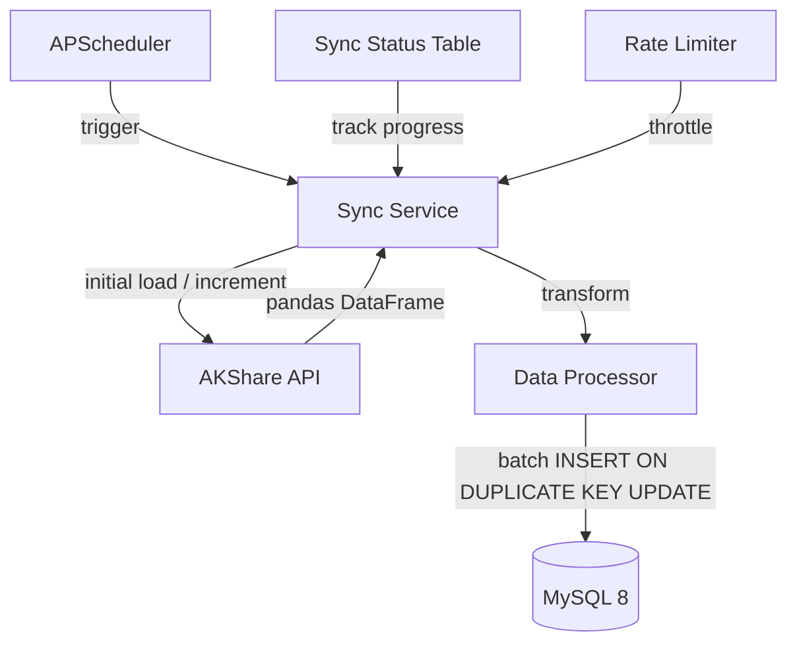

# P1 Data Layer Design — A-stock Data Warehouse

## 1. AKShare A-stock Data Survey

### 1.1 Available Data Categories

| # | Category | Function | Data Volume | Update Frequency |
|---|----------|----------|-------------|------------------|
| 1 | 股票列表 | `stock_info_a_code_name()` | ~5,500 rows | Monthly |
| 2 | 实时行情 | `stock_zh_a_spot_em()` | ~5,500 rows | Trading days |
| 3 | 历史日K线 | `stock_zh_a_hist(period='daily')` | ~40M rows (30y) | Trading days |
| 4 | 历史周K线 | `stock_zh_a_hist(period='weekly')` | ~8M rows | Weekly |
| 5 | 历史月K线 | `stock_zh_a_hist(period='monthly')` | ~2M rows | Monthly |
| 6 | 分钟K线 | `stock_zh_a_hist_min_em()` | Huge | Intraday |
| 7 | 业绩报表 | `stock_yjbb_em()` | ~88 quarters × stocks | Quarterly |
| 8 | 财务指标 | `stock_financial_analysis_indicator()` | ~30y × stocks | Quarterly |
| 9 | 盈利预测 | `stock_profit_forecast_em()` | ~5,500 rows | Irregular |
| 10 | 行业板块 | `stock_board_industry_name_em()` | ~60 rows | Irregular |
| 11 | 概念板块 | `stock_board_concept_name_em()` | ~400 rows | Irregular |
| 12 | 资金流向 | `stock_individual_fund_flow()` | ~5,500 × days | Trading days |

### 1.2 Key Function Return Fields

#### stock_info_a_code_name() — A-stock Master
```
code       CHAR(6)    股票代码 (e.g. "000001")
name       VARCHAR    股票简称 (e.g. "平安银行")
```

#### stock_zh_a_spot_em() — Real-time Snapshot
```
代码               最新价              涨跌幅              涨跌额
成交量              成交额              振幅                最高
最低               今开               昨收                量比
换手率             市盈率-动态         市净率              总市值
流通市值            涨速               5分钟涨跌           60日涨跌幅
年初至今涨跌幅
```

#### stock_zh_a_hist() — Historical K-line (CORE)
```
日期        date        Trade date
股票代码    char(6)     Stock code
开盘        decimal     Open
收盘        decimal     Close
最高        decimal     High
最低        decimal     Low
成交量      decimal     Volume (shares)
成交额      decimal     Amount (CNY)
振幅        decimal     Amplitude %
涨跌幅      decimal     Change %
涨跌额      decimal     Change amount
换手率      decimal     Turnover rate %
```
Parameters: `period` (daily/weekly/monthly), `adjust` (""/qfq/hfq)

#### stock_yjbb_em() — Quarterly Performance Report
```
股票代码              每股收益            营业总收入
营业总收入-同比增长    营业总收入-季度环比增长  净利润
净利润-同比增长        净利润-季度环比增长    每股净资产
净资产收益率          每股经营现金流量      销售毛利率
所处行业              最新公告日期
```

#### stock_financial_analysis_indicator() — Detailed Financial Indicators
```
每股指标:     基本每股收益, 稀释每股收益, 每股净资产, 每股经营现金流...
盈利能力:     净资产收益率, 总资产报酬率, 销售毛利率, 销售净利率...
成长能力:     主营收入增长率, 净利润增长率, 总资产增长率...
营运能力:     应收账款周转率, 存货周转率, 总资产周转率...
偿债能力:     流动比率, 速动比率, 资产负债率...
现金流量:     经营现金流量净额, 投资现金流量净额...
```

#### stock_profit_forecast_em() — Analyst Profit Forecasts
```
代码          名称          研报数
机构投资评级-买入/增持/中性/减持/卖出  (counts)
YYYY预测每股收益  YYYY预测净利润  (x4 years)
```

#### stock_individual_fund_flow() — Fund Flow
```
日期          收盘价        涨跌幅
主力净流入-净额  主力净流入-净占比
超大单净流入-净额 超大单净流入-净占比
大单净流入-净额  大单净流入-净占比
中单净流入-净额  中单净流入-净占比
小单净流入-净额  小单净流入-净占比
```

---

## 2. Database Schema Design

### 2.1 Table Summary

| Table | Estimated Rows | Storage (GB) |
|-------|---------------|--------------|
| `stock_info` | 5,500 | < 1 MB |
| `stock_daily_quote` | 40,000,000 | ~4 GB |
| `stock_weekly_quote` | 8,000,000 | ~0.8 GB |
| `stock_monthly_quote` | 2,000,000 | ~0.2 GB |
| `stock_performance_report` | 500,000 | ~50 MB |
| `stock_financial_indicator` | 600,000 | ~200 MB |
| `stock_profit_forecast` | 100,000 | ~20 MB |
| `stock_fund_flow_daily` | 5,000,000 | ~0.5 GB |
| `stock_board_info` | 500 | < 1 MB |
| `stock_board_member` | 100,000 | < 5 MB |
| **Total** | **~55M rows** | **~6 GB** |

### 2.2 Table Definitions

#### stock_info — Stock Master
```sql
CREATE TABLE stock_info (
    code            CHAR(6)     PRIMARY KEY COMMENT '股票代码',
    name            VARCHAR(20) NOT NULL COMMENT '股票简称',
    exchange        ENUM('SH','SZ','BJ') NOT NULL COMMENT '交易所',
    board_type      ENUM('主板','科创板','创业板','北交所') COMMENT '板块类型',
    industry        VARCHAR(50) COMMENT '所属行业',
    is_active       BOOLEAN     DEFAULT TRUE COMMENT '是否上市',
    listed_date     DATE        COMMENT '上市日期',
    created_at      DATETIME    DEFAULT CURRENT_TIMESTAMP,
    updated_at      DATETIME    DEFAULT CURRENT_TIMESTAMP ON UPDATE CURRENT_TIMESTAMP,
    INDEX idx_exchange (exchange),
    INDEX idx_board_type (board_type),
    INDEX idx_industry (industry)
) COMMENT 'A股基本信息';
```

#### stock_daily_quote — Daily K-line (LARGEST TABLE)
```sql
CREATE TABLE stock_daily_quote (
    id              CHAR(36)    PRIMARY KEY COMMENT 'UUID',
    stock_code      CHAR(6)     NOT NULL COMMENT '股票代码',
    trade_date      DATE        NOT NULL COMMENT '交易日期',
    adjust_type     ENUM('none','qfq','hfq') NOT NULL DEFAULT 'qfq' COMMENT '复权类型',
    open            DECIMAL(10,3) NOT NULL COMMENT '开盘价',
    close           DECIMAL(10,3) NOT NULL COMMENT '收盘价',
    high            DECIMAL(10,3) NOT NULL COMMENT '最高价',
    low             DECIMAL(10,3) NOT NULL COMMENT '最低价',
    volume          BIGINT      NOT NULL COMMENT '成交量(股)',
    amount          DECIMAL(18,2) NOT NULL COMMENT '成交额(元)',
    amplitude       DECIMAL(8,3) COMMENT '振幅%',
    change_pct      DECIMAL(8,3) COMMENT '涨跌幅%',
    change_amount   DECIMAL(10,3) COMMENT '涨跌额',
    turnover_rate   DECIMAL(8,3) COMMENT '换手率%',
    created_at      DATETIME    DEFAULT CURRENT_TIMESTAMP,
    updated_at      DATETIME    DEFAULT CURRENT_TIMESTAMP ON UPDATE CURRENT_TIMESTAMP,
    UNIQUE KEY uq_stock_date_adj (stock_code, trade_date, adjust_type),
    INDEX idx_trade_date (trade_date),
    INDEX idx_stock_code (stock_code)
) COMMENT 'A股日K线行情'
PARTITION BY RANGE (YEAR(trade_date)) (
    PARTITION p1990 VALUES LESS THAN (1995),
    PARTITION p1995 VALUES LESS THAN (2000),
    PARTITION p2000 VALUES LESS THAN (2005),
    PARTITION p2005 VALUES LESS THAN (2010),
    PARTITION p2010 VALUES LESS THAN (2015),
    PARTITION p2015 VALUES LESS THAN (2020),
    PARTITION p2020 VALUES LESS THAN (2022),
    PARTITION p2022 VALUES LESS THAN (2023),
    PARTITION p2023 VALUES LESS THAN (2024),
    PARTITION p2024 VALUES LESS THAN (2025),
    PARTITION p2025 VALUES LESS THAN (2026),
    PARTITION p2026 VALUES LESS THAN (2027),
    PARTITION p_future VALUES LESS THAN MAXVALUE
);
```

#### stock_weekly_quote / stock_monthly_quote
Same structure as `stock_daily_quote` (without partitioning, or lighter partitioning).

#### stock_performance_report — Quarterly Reports
```sql
CREATE TABLE stock_performance_report (
    id              CHAR(36)    PRIMARY KEY COMMENT 'UUID',
    stock_code      CHAR(6)     NOT NULL COMMENT '股票代码',
    stock_name      VARCHAR(20) COMMENT '股票简称',
    report_date     DATE        NOT NULL COMMENT '报告期 (e.g. 2024-03-31)',
    eps             DECIMAL(10,4) COMMENT '每股收益',
    revenue         DECIMAL(20,4) COMMENT '营业总收入(元)',
    revenue_yoy     DECIMAL(8,3) COMMENT '营业总收入同比增长%',
    revenue_qoq     DECIMAL(8,3) COMMENT '营业总收入环比增长%',
    net_profit      DECIMAL(20,4) COMMENT '净利润(元)',
    net_profit_yoy  DECIMAL(8,3) COMMENT '净利润同比增长%',
    net_profit_qoq  DECIMAL(8,3) COMMENT '净利润环比增长%',
    bvps            DECIMAL(10,4) COMMENT '每股净资产',
    roe             DECIMAL(8,3) COMMENT '净资产收益率%',
    cfps            DECIMAL(10,4) COMMENT '每股经营现金流量',
    gross_margin    DECIMAL(8,3) COMMENT '销售毛利率%',
    industry        VARCHAR(50) COMMENT '所处行业',
    announce_date   DATE        COMMENT '最新公告日期',
    created_at      DATETIME    DEFAULT CURRENT_TIMESTAMP,
    UNIQUE KEY uq_stock_report (stock_code, report_date),
    INDEX idx_report_date (report_date),
    INDEX idx_stock_code (stock_code)
) COMMENT 'A股业绩报表';
```

#### stock_financial_indicator — Detailed Financial Indicators
```sql
CREATE TABLE stock_financial_indicator (
    id              CHAR(36)    PRIMARY KEY COMMENT 'UUID',
    stock_code      CHAR(6)     NOT NULL COMMENT '股票代码',
    report_date     DATE        NOT NULL COMMENT '报告期',
    -- 每股指标 (Per Share)
    eps_basic       DECIMAL(10,4) COMMENT '基本每股收益',
    eps_diluted     DECIMAL(10,4) COMMENT '稀释每股收益',
    bvps            DECIMAL(10,4) COMMENT '每股净资产',
    cfps            DECIMAL(10,4) COMMENT '每股经营现金流',
    -- 盈利能力 (Profitability)
    roe             DECIMAL(8,3) COMMENT '净资产收益率%',
    roa             DECIMAL(8,3) COMMENT '总资产报酬率%',
    gross_margin    DECIMAL(8,3) COMMENT '销售毛利率%',
    net_margin      DECIMAL(8,3) COMMENT '销售净利率%',
    -- 成长能力 (Growth)
    revenue_growth  DECIMAL(8,3) COMMENT '主营收入增长率%',
    profit_growth   DECIMAL(8,3) COMMENT '净利润增长率%',
    asset_growth    DECIMAL(8,3) COMMENT '总资产增长率%',
    -- 营运能力 (Operational)
    receivables_turnover    DECIMAL(8,3) COMMENT '应收账款周转率(次)',
    inventory_turnover      DECIMAL(8,3) COMMENT '存货周转率(次)',
    asset_turnover          DECIMAL(8,3) COMMENT '总资产周转率(次)',
    -- 偿债能力 (Solvency)
    current_ratio   DECIMAL(8,3) COMMENT '流动比率',
    quick_ratio     DECIMAL(8,3) COMMENT '速动比率',
    debt_ratio      DECIMAL(8,3) COMMENT '资产负债率%',
    -- 现金流 (Cash Flow)
    operating_cf    DECIMAL(20,4) COMMENT '经营活动现金流净额',
    investing_cf    DECIMAL(20,4) COMMENT '投资活动现金流净额',
    financing_cf    DECIMAL(20,4) COMMENT '筹资活动现金流净额',
    created_at      DATETIME    DEFAULT CURRENT_TIMESTAMP,
    UNIQUE KEY uq_stock_fin_indicator (stock_code, report_date),
    INDEX idx_report_date (report_date)
) COMMENT 'A股财务指标';
```

#### stock_profit_forecast — Analyst Forecasts
```sql
CREATE TABLE stock_profit_forecast (
    id                  CHAR(36)    PRIMARY KEY COMMENT 'UUID',
    stock_code          CHAR(6)     NOT NULL COMMENT '股票代码',
    stock_name          VARCHAR(20) COMMENT '股票简称',
    research_report_num INT         COMMENT '研报数',
    rating_buy          INT         COMMENT '买入评级数',
    rating_overweight   INT         COMMENT '增持评级数',
    rating_neutral      INT         COMMENT '中性评级数',
    rating_underweight  INT         COMMENT '减持评级数',
    rating_sell         INT         COMMENT '卖出评级数',
    forecast_eps_year1  DECIMAL(10,4) COMMENT '预测每股收益(第一年)',
    forecast_eps_year2  DECIMAL(10,4),
    forecast_eps_year3  DECIMAL(10,4),
    forecast_eps_year4  DECIMAL(10,4),
    forecast_np_year1   DECIMAL(20,4) COMMENT '预测净利润(第一年)',
    forecast_np_year2   DECIMAL(20,4),
    forecast_np_year3   DECIMAL(20,4),
    forecast_np_year4   DECIMAL(20,4),
    target_avg_price    DECIMAL(10,3) COMMENT '目标均价',
    updated_date        DATE        COMMENT '数据更新日期',
    created_at          DATETIME    DEFAULT CURRENT_TIMESTAMP,
    UNIQUE KEY uq_stock_forecast (stock_code, updated_date),
    INDEX idx_stock_code (stock_code)
) COMMENT 'A股盈利预测';
```

#### stock_fund_flow_daily — Daily Fund Flow
```sql
CREATE TABLE stock_fund_flow_daily (
    id                  CHAR(36)    PRIMARY KEY COMMENT 'UUID',
    stock_code          CHAR(6)     NOT NULL COMMENT '股票代码',
    trade_date          DATE        NOT NULL COMMENT '交易日期',
    close               DECIMAL(10,3) COMMENT '收盘价',
    change_pct          DECIMAL(8,3) COMMENT '涨跌幅%',
    main_net_inflow     DECIMAL(20,2) COMMENT '主力净流入-净额',
    main_net_ratio      DECIMAL(8,3) COMMENT '主力净流入-净占比%',
    huge_net_inflow     DECIMAL(20,2) COMMENT '超大单净流入-净额',
    huge_net_ratio      DECIMAL(8,3) COMMENT '超大单净流入-净占比%',
    large_net_inflow    DECIMAL(20,2) COMMENT '大单净流入-净额',
    large_net_ratio     DECIMAL(8,3) COMMENT '大单净流入-净占比%',
    medium_net_inflow   DECIMAL(20,2) COMMENT '中单净流入-净额',
    medium_net_ratio    DECIMAL(8,3) COMMENT '中单净流入-净占比%',
    small_net_inflow    DECIMAL(20,2) COMMENT '小单净流入-净额',
    small_net_ratio     DECIMAL(8,3) COMMENT '小单净流入-净占比%',
    created_at          DATETIME    DEFAULT CURRENT_TIMESTAMP,
    UNIQUE KEY uq_stock_fundflow_date (stock_code, trade_date),
    INDEX idx_trade_date (trade_date)
) COMMENT 'A股资金流向';
```

#### stock_board_info — Industry/Concept Boards
```sql
CREATE TABLE stock_board_info (
    id              CHAR(36)    PRIMARY KEY COMMENT 'UUID',
    board_code      VARCHAR(20) NOT NULL COMMENT '板块代码',
    board_name      VARCHAR(50) NOT NULL COMMENT '板块名称',
    board_type      ENUM('industry','concept') NOT NULL COMMENT '板块类型',
    source          ENUM('em','ths') NOT NULL COMMENT '数据源',
    created_at      DATETIME    DEFAULT CURRENT_TIMESTAMP,
    UNIQUE KEY uq_board (board_name, board_type, source)
) COMMENT '行业/概念板块';

CREATE TABLE stock_board_member (
    id              CHAR(36)    PRIMARY KEY COMMENT 'UUID',
    board_id        CHAR(36)    NOT NULL COMMENT '板块ID',
    stock_code      CHAR(6)     NOT NULL COMMENT '股票代码',
    created_at      DATETIME    DEFAULT CURRENT_TIMESTAMP,
    UNIQUE KEY uq_board_stock (board_id, stock_code),
    INDEX idx_stock_code (stock_code)
) COMMENT '板块成分股';
```

---

## 3. Data Sync Strategy

### 3.1 Architecture



### 3.2 Two-Phase Sync

#### Phase A: Initial Full Load (One-time)
```
Order: stock_info → stock_daily_quote → stock_performance_report 
       → stock_financial_indicator → stock_profit_forecast 
       → stock_board_info → stock_fund_flow_daily

Strategy:
  - stock_info:        1 API call  → bulk insert all 5,500 stocks
  - stock_daily_quote: loop 5,500 stocks, each fetches 30y history
                        Use ThreadPoolExecutor(max_workers=5) for concurrency
                        Rate limit: 500ms delay between calls
                        Estimated time: 5,500 × 0.5s = ~46 minutes (worst case)
  - Financial data:    loop stocks, 1 call per stock
  - Fund flow:         loop stocks, paginated
```

#### Phase B: Incremental Daily Sync (Scheduler)
```
schedule:  Trading day at 16:00 (after market close)

Tasks:
  1. stock_info:         Weekly check for new listings
  2. stock_daily_quote:  Fetch last 3 days per stock (backfill)
  3. stock_performance_report: Check announcement dates, pull new quarters
  4. stock_financial_indicator: Same as above
  5. stock_profit_forecast: Weekly refresh
  6. stock_fund_flow_daily: Daily fetch last trading day
```

### 3.3 Sync Status Tracking Table

```sql
CREATE TABLE sync_status (
    table_name      VARCHAR(50) PRIMARY KEY COMMENT '表名',
    last_sync_time  DATETIME COMMENT '最近同步时间',
    last_data_date  DATE COMMENT '最新数据日期',
    row_count       INT COMMENT '当前行数',
    status          ENUM('idle','syncing','error') DEFAULT 'idle',
    error_message   TEXT COMMENT '错误信息',
    updated_at      DATETIME DEFAULT CURRENT_TIMESTAMP ON UPDATE CURRENT_TIMESTAMP
) COMMENT '数据同步状态';
```

### 3.4 Rate Limiting & Resilience

- AKShare's underlying data sources (东方财富) have anti-crawler measures
- **Delay**: 300-500ms between API calls
- **Retry**: 3 retries with exponential backoff (1s, 4s, 16s)
- **Batch**: Process stocks in batches of 50, commit per batch
- **Resume**: Use `sync_status` table to resume from where it left off

---

## 4. Service Layer Design

### 4.1 Service Responsibility Map

```python
# backend/app/services/

stock_sync_service.py    # AKShare data fetching + DB persistence
stock_query_service.py   # Read queries for API layer
financial_service.py     # Financial data queries + derived indicators
board_service.py         # Industry/concept board operations
sync_manager.py          # Orchestrates sync tasks, tracks status
```

### 4.2 Sync Service Pattern

```python
# Pseudocode
class StockSyncService:
    def __init__(self, db: AsyncSession):
        self.db = db
    
    async def sync_stock_list(self) -> int:
        """Fetch full A-stock list from AKShare, upsert into stock_info."""
        df = await asyncio.to_thread(ak.stock_info_a_code_name)
        stocks = [StockInfo(code=r['code'], name=r['name'], ...) for _, r in df.iterrows()]
        await self._batch_upsert(stocks, StockInfo)
        return len(stocks)
    
    async def sync_daily_quotes(
        self, stock_code: str, 
        start_date: str = "19900101", 
        adjust_type: str = "qfq"
    ) -> int:
        """Sync one stock's full daily K-line history."""
        df = await asyncio.to_thread(
            ak.stock_zh_a_hist, symbol=stock_code, period="daily",
            start_date=start_date, adjust=adjust_type
        )
        quotes = [DailyQuote(stock_code=c, trade_date=d, ...) for ...]
        await self._batch_upsert(quotes, DailyQuote)
        return len(quotes)
```

### 4.3 API Endpoints (P3 scope, design now)

```
GET  /api/v1/stocks                          # List all stocks (paginated, filterable)
GET  /api/v1/stocks/{code}                   # Stock basic info
GET  /api/v1/stocks/{code}/daily             # Daily K-line (query: start_date, end_date, adjust_type)
GET  /api/v1/stocks/{code}/weekly            # Weekly K-line
GET  /api/v1/stocks/{code}/monthly           # Monthly K-line
GET  /api/v1/stocks/{code}/financials        # Financial indicators
GET  /api/v1/stocks/{code}/performance       # Performance reports
GET  /api/v1/stocks/{code}/forecast          # Profit forecasts
GET  /api/v1/stocks/{code}/fund-flow         # Fund flow data
GET  /api/v1/boards                          # List industry/concept boards
GET  /api/v1/boards/{id}/members             # Board constituent stocks
GET  /api/v1/market/summary                  # Market overview (from spot data)
```

---

## 5. Implementation Steps

| Step | Task | Estimate |
|------|------|----------|
| 5.1 | Create ORM models (9 model classes) | 2h |
| 5.2 | Create Alembic migration | 0.5h |
| 5.3 | Implement `SyncStatus` tracking | 0.5h |
| 5.4 | Implement `StockSyncService` (core sync logic) | 4h |
| 5.5 | Implement rate limiter & retry decorators | 1h |
| 5.6 | Implement initial full-load script | 2h |
| 5.7 | Implement `StockQueryService` (read queries) | 3h |
| 5.8 | Implement API endpoints (10+ routers) | 3h |
| 5.9 | Set up APScheduler incremental sync tasks | 2h |
| 5.10 | Write integration tests | 2h |
| **Total** | | **~20h** |

---

## 6. Key Design Decisions

### DD-002: Partition daily_quote by year
- **Decision**: Partition `stock_daily_quote` by `YEAR(trade_date)`, one partition per year
- **Why**: 40M+ rows; queries are always time-ranged; old partitions can be archived
- **Trade-off**: Slightly more complex DDL

### DD-003: Store 3 adjust types separately
- **Decision**: `adjust_type` column with values `none`/`qfq`/`hfq` in the same table
- **Why**: All three are useful for different analysis; single table simplifies queries
- **Trade-off**: ~3x data volume for daily quotes (~120M rows total with 3 types)

### DD-004: Financial data — wide table vs EAV
- **Decision**: Wide table (`stock_financial_indicator`) with fixed columns
- **Why**: Indicators are well-known and stable; wide table is simpler to query and index
- **Alternative**: JSON column or EAV for flexibility — can migrate later if needed

### DD-005: AKShare calls via asyncio.to_thread
- **Decision**: Wrap all AKShare calls in `asyncio.to_thread()`
- **Why**: AKShare is synchronous (requests-based); FastAPI is async. Thread pool avoids blocking the event loop.
- **Trade-off**: Slightly higher memory (one thread per concurrent call)

### DD-006: Sync only 前复权 for initial load
- **Decision**: First sync `qfq` (most commonly used), `hfq` and `none` as optional later passes
- **Why**: Reduces initial sync time by 3x; users can request additional adjust types on demand
```

